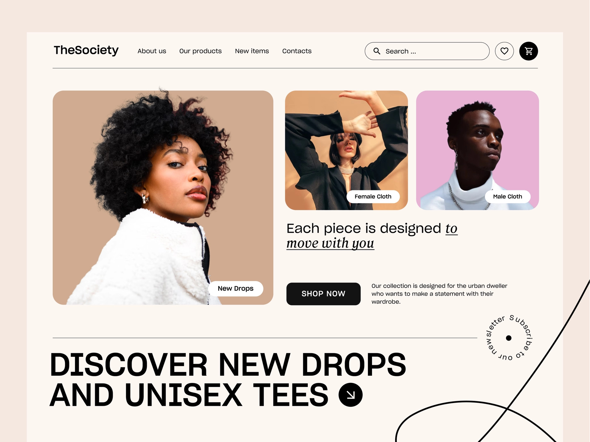

<h1>TheSociety</h1>

[Live](https://thesociety.kutaybekleric.com)

<h3>A fullstack E-commerce App</h3>

# Introduction
This is my first time using Next.js. After feeling confident in React, I wanted to make a Fullstack project with Next.js. I know the code isn't the best, but _**it works**_. I wanted to make a project that is focused on UX as a whole and little **QOL _(Quality of life)_** stuff. I would appreciate and encourage anyone to find a bug/issue and submit it through issues tab.

## Tech Stack

- Next.js
- Prisma _(First and last time using prisma. **Drizzle FTW**)_
- PostgreSQL
- Tailwind
- Typescript
- Context API

## Features

- <b>Credentials Authentication</b>  

I wanted to use Credentials because I already had some experience using OAUTH in express. And since Credentials is a
bit of pain to customize it seemed like a good challenge.

- <b>Instagram like routing</b>  

When clicking on a product it opens as a modal, but the url changes to the product's specific page. So if you wanted
to share a product without going to its specific page you can just copy the url and when the url is opened it opens
the product's specific page. __(Not the modal)__

- <b>The items inside the cart are saved to local storage</b> 

Just a simple QOL feature.

- <b>Instant feedback on UI</b> 

I used react-hot-toast for notifications and feedback for better UX.

- <b>Users can create and edit their own custom profile</b> 

When logged in, users are redirected to their profile page. If they don't have a profile page then they are redirected
to the profile edit route where they can create their profile.

- <b>Sessions and Middleware</b> 

After logging in users are not allowed to see login or register page. And to reach profile routes they need to be logged in.
 

## Design
I came across this landing page design on dribbble. Unfortunately I lost the link to the design. The reason for the inconsistency between the design of the landing page and other pages because the design only consisted of landing page, so I had to improvise, but I also didn't want to spend so much time on design and I put that time into functionality.

## Challenges

## Roadmap
- [ ] The website is made for around 1600px and 1900px. Some of the components are responsive till 1200px. Will add full responsiveness and mobile design.